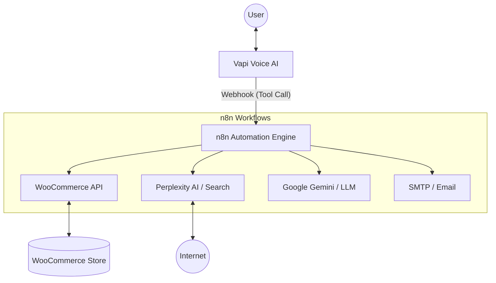

# Project Architecture: E-commerce AI Voice Assistant

This project implements a sophisticated AI-powered voice assistant for **SAH Kitchen**, a commercial kitchen equipment provider. The system integrates **Vapi** for voice orchestration and **n8n** for backend logic, automation, and third-party integrations.

## System Overview

The architecture follows a modular approach where Vapi handles the real-time voice interaction (STT, TTS, and LLM orchestration), while n8n serves as the "brain" for executing complex tools and workflows.

### High-Level Architecture

## Core Components

### 1. Vapi (Voice AI Platform)
- **Persona**: "Ryan," a senior kitchen consultant.
- **Master Prompt**: Defines the identity, tone, and operational boundaries of the assistant.
- **Functionality**: Manages the call lifecycle, handles interruptions, and triggers tools based on user intent.
- **Tools**: Maps user requests (e.g., "Check my order status") to specific n8n webhooks.

### 2. n8n (Workflow Automation)
Each Vapi tool corresponds to an n8n workflow. The workflows are triggered via POST webhooks and respond back to Vapi in the required JSON format.

#### Key Workflows & Tools:
- **Internet Search**: Uses Perplexity AI (`sonar-deep-research`) to provide live, data-backed answers about kitchen equipment and industry trends.
- **WooCommerce Integration**:
    - `Get Product Tool`: Fetches real-time product data (price, stock, description) from the WooCommerce store.
    - `Get Order Tool`: Retrieves order status and details for customers.
- **Communication Tools**:
    - `Send Email to User`: Uses Google Gemini to draft personalized, professional emails based on the conversation and sends them via SMTP.
    - `Send Email to Support Team`: Forwards complex inquiries or quotation requests to the internal support team.
    - `Send Supplier Email`: Automates communication with equipment suppliers.
- **Call Hooks**: `Call Start/End Tool` manages session-level logic and logging.

### 3. AI & External Services
- **Google Gemini 2.0 Flash**: Powers the drafting of professional emails within n8n workflows.
- **Perplexity AI**: Provides real-time internet search capabilities for technical specifications and market pricing.
- **WooCommerce**: The primary database for products and customer orders.
- **SMTP**: Securely sends transactional and support emails.

## Data Flow

1. **User Input**: The user speaks to the assistant (e.g., "What's the price of a combi oven?").
2. **Intent Recognition**: Vapi converts speech to text and identifies that the `get_product` tool is needed.
3. **Webhook Trigger**: Vapi sends a POST request to the n8n `Get Product` webhook with relevant arguments.
4. **Execution**: n8n queries the WooCommerce API, processes the data (using Python for cleaning), and prepares a response.
5. **Feedback**: n8n sends the data back to Vapi.
6. **Output**: Vapi synthesizes the information into a natural voice response for the user.

## Project Structure
- `/vapi`: Contains the `master-prompt.txt` for the AI persona.
- `/workflow`: Contains the exported n8n workflow JSON files.
- `/screenshot`: Visual documentation of the tool configurations.
